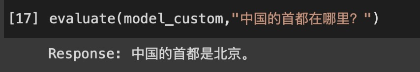

# 骆驼(Luotuo): Chinese-alpaca-lora
骆驼(Luotuo) is the Chinese pinyin(pronunciation) of camel
A Chinese finetuned instruction LLaMA. Developed by 冷子昂 @ 商汤科技, 陈启源 @ 华中师范大学(Third year undergraduate student) and 李鲁鲁 @ 商汤科技
(email: chengli@sensetime.com, zaleng@bu.edu, chenqiyuan1012@foxmail.com)

<p align="center">
  
</p>

This is NOT an official product of SenseTime

This project only made a slightly change on the Japanese-Alpaca-LoRA

We named project in Camel because both LLaMA and alpaca are all belongs to Artiodactyla-Camelidae(偶蹄目-骆驼科)

## A Quick Demo

TODO: add a table here link to colab

## Simply Demo

Evaluation code are now in notebook/evaluation_code.ipynb

### Good Examples

```
Input: 中国的首都在哪里？
Luotuo-Output: 中国的首都是北京。
```

<p align="center">
  
</p>

```
Input: 麦当劳是哪个国家的？
Luotuo-Output: 美国。
```

```
Input: 2017年美国总统是谁
Luotuo-Output: 2017年美国总统是特朗普
```


### Bad Examples

```
Input: 商汤科技是做什么的？
Luotuo-Output: 商汤科技是一种技术，它用于创建互联网应用程序和服务。
```

```
Input: 猫和狗的关系是什么
Luotuo-Output: 猫和狗之间的关系是友好的。它们通常在一起休息或玩耍。猫和狗之间的关系通常很好，它们通常在一起休息或玩耍。猫和狗之间的关系通常很好，它们通常在一起休息或玩耍。猫和狗之间的关系通常很好，它们通常在一起休息或玩耍。猫和狗之间的关系通常很好，它们通常在一起休息或玩耍。猫和狗之间的关系通常很好，它们通常在一起休息或玩耍。猫和狗之间的关系通常
```

```
Input: 华中师范大学在哪里？
Luotuo-Output: 华中师范大学位于北京
```


## Data

This is an inbuilding project

A. We plan to tune a Chinese LLaMA model baed on [LLaMA](https://ai.facebook.com/blog/large-language-model-llama-meta-ai/), [Stanford Alpaca](https://github.com/tatsu-lab/stanford_alpaca), [Alpaca LoRA](https://github.com/tloen/alpaca-lora), [cabrita](https://github.com/22-hours/cabrita), [Japanese-Alpaca-LoRA](https://github.com/masa3141/japanese-alpaca-lora)

B. We are also plan to consider the data in [Guanaco](https://guanaco-model.github.io/) hikariming's [alpaca_chinese_dataset](https://github.com/hikariming/alpaca_chinese_dataset) and carbonz0‘s [alpaca-chinese-dataset](https://github.com/carbonz0/alpaca-chinese-dataset), may updated it into later version. 

We plan to upload two different models A and B, because the provider of B claim the clean data will bring significant improvement.

## TODO

inbuilding project
- [x] test translate script (test for 10 lines)
- [x] buy openAI API
- [x] translate alpaca json data
- [x] finetuning with lora(model A)
- [x] qualitative test (model A)
- [ ] upload training code to git
- [ ] upload to huggingFace
- [ ] train lora with more alpaca data(model B)
- [ ] write colab example
- [ ] write colab + gradio example

## Citation 
If you find this project useful in your research, please consider citing:

```
@inproceedings{leng2023luotuo-ch-alpaca,
  title={Luotuo: Chinese-alpaca-lora},
  author={Ziang Leng, Qiyuan Chen and Cheng Li},
  url={https://github.com/LC1332/Chinese-alpaca-lora},
  year={2023}
}
```

