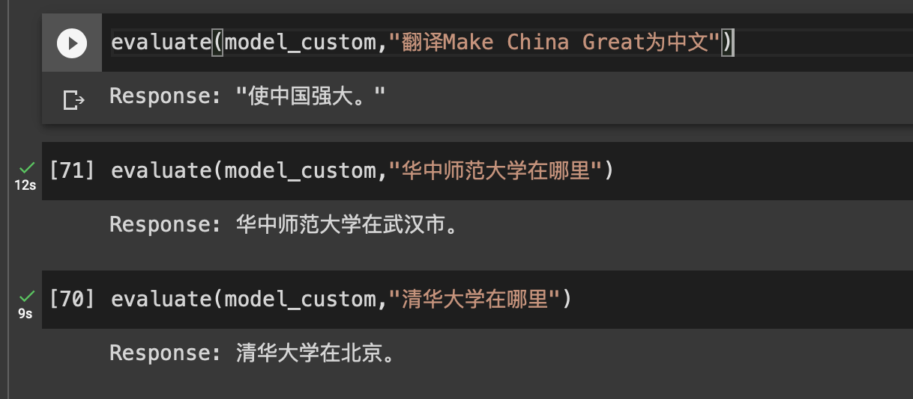

# 骆驼(Luotuo): Chinese-alpaca-lora

骆驼(Luotuo) is the Chinese pinyin(pronunciation) of camel

A Chinese finetuned instruction LLaMA. Developed by 冷子昂 @ 商汤科技, 陈启源 @ 华中师范大学(Third year undergraduate student) and 李鲁鲁 @ 商汤科技

(email: chengli@sensetime.com, zaleng@bu.edu, chenqiyuan1012@foxmail.com)

<p align="center">
  
</p>

This is NOT an official product of SenseTime

We named project in Luotuo(Camel) because both LLaMA and alpaca are all belongs to Artiodactyla-Camelidae(偶蹄目-骆驼科)

## News

[2023-3-23] luotuo-chinese-lora-7b-0.3 was released!

## A Quick Start

| Colab Link |  | detail |
| --- | --- | :--- |
| A quick evaluation | <a href="https://colab.research.google.com/drive/1rX5DFkbX7YLu1isRqChFfybJdZ8pOTOb?usp=sharing" target="_parent"></a> | Evaluation code with standard HuggingFace pipeline |
| Bot with Interface | <a href="https://colab.research.google.com/drive/1q5h77xrbLGT5b-W3547a99YMNEJ0qhWc?usp=sharing" target="_parent"></a>  | Interactive Chatting Bot using Gradio |
| Training Code | To be released | Training code, run on colab |
| Data Translation  | <a href="https://colab.research.google.com/drive/11x1xxizL4qw4biX89QFlnP9C7cg8b7A5?usp=sharing" target="_parent"></a> | Translation alpaca.json into Chinese |


## Trained Model

| Model Name | Training Data and Setting |
| --- | :--- |
| [luotuo-lora-7b-0.1](https://huggingface.co/qychen/luotuo-lora-7b-0.1/tree/main) | Trained on Translated alpaca 52k data |
| luotuo-lora-7b-0.3 | (In Plan) cleaned alpaca 52k + 10% guanaco |
| luotuo-lora-7b-0.9 | (In Plan) cleaned alpaca 52k + full guanaco |

luotuo-lora-7b-0.3 the performance seems have significant improvement than 0.1, even just after 1 epoch.

<p align="center">
  
</p>

But 1 epoch cost us 7 hours to train, which cost more than $10. We will keep continue tuning it later.

## Qualitative Result(0.3)

Evaluation code are now in notebook/evaluation_code.ipynb

### Good Examples

```
Input: 中国的首都在哪里？
Luotuo-Output: 中国的首都是北京。
```

```
Input: 麦当劳是哪个国家的？
Luotuo-Output: 美国。
```

```
Input: 2017年美国总统是谁
Luotuo-Output: 2017年美国总统是特朗普
```


```
Input: 华中师范大学在哪里
Luotuo-0.1-Output: 华中师范大学位于北京
Luotuo-0.3-Output: 华中师范大学在武汉市。
```

this example failed in 0.1

### Bad Examples

```
Input: 商汤科技是做什么的？
Luotuo-0.1-Output: 商汤科技是一种技术，它用于创建互联网应用程序和服务。
Luotuo-0.3-Output: 商汤科技是一种技术，它可以用于创建新的产品和服务，以增加产品和服务的吸引力。它可以用于创建新的产品和服务，以增加产品和服务的吸引力。它可以用于创建新的产品和服务，以增加产品和服务的吸引力。它可以用于创建新的产品和服务，以增加产品和服务的吸引力。它可以用于创建新的产品和服务，以增加产品和服务的吸引力。它可以用于创建新的产品和服务，以增加产品和服务的吸引力。它可以用于创建新的
```

```
Input: 猫和狗的关系是什么
Luotuo-Output: 猫和狗之间的关系是友好的。它们通常在一起休息或玩耍。猫和狗之间的关系通常很好，它们通常在一起休息或玩耍。猫和狗之间的关系通常很好，它们通常在一起休息或玩耍。猫和狗之间的关系通常很好，它们通常在一起休息或玩耍。猫和狗之间的关系通常很好，它们通常在一起休息或玩耍。猫和狗之间的关系通常很好，它们通常在一起休息或玩耍。猫和狗之间的关系通常
```

## Training

We have tuned a Chinese LLaMA model baed on [LLaMA](https://ai.facebook.com/blog/large-language-model-llama-meta-ai/), [Stanford Alpaca](https://github.com/tatsu-lab/stanford_alpaca), [Alpaca LoRA](https://github.com/tloen/alpaca-lora), [cabrita](https://github.com/22-hours/cabrita), [Japanese-Alpaca-LoRA](https://github.com/masa3141/japanese-alpaca-lora)

The training code in in cleaning, if you are in very hurry, check the Japanese project and simply change the json training data file name.

## Data

This is an inbuilding project

The training code only made a slightly change on the Japanese-Alpaca-LoRA

A. [0.1 version model](https://huggingface.co/qychen/luotuo-lora-7b-0.1/tree/main) was trained on translated data, which translate the [alpaca_data.json](https://github.com/tatsu-lab/stanford_alpaca/blob/main/alpaca_data.json) to Chinese using ChatGPT API.
We paid around US $30-45 to translate the full dataset to chinese. Translated data is available. ([trans_chinese_alpaca_data.json](data/trans_chinese_alpaca_data.json))

B. We are also plan to consider the data in [Guanaco](https://guanaco-model.github.io/) hikariming's [alpaca_chinese_dataset](https://github.com/hikariming/alpaca_chinese_dataset) and carbonz0‘s [alpaca-chinese-dataset](https://github.com/carbonz0/alpaca-chinese-dataset), may updated it into later version.

We plan to upload two different models A and B, because the provider of B claim the clean data will bring significant improvement.

## Sponsorships(赞助)

Top 3 Sponsors

| Time      | Sponsor     | Amount | Balance |
| --- | --- | --- | --- |
| 2023/3/23 | AJ19( **亚) | 200    | -       |
| 2023/3/23 | 冯偲        | 200    | -       |
| 2023/3/23 | **俊        | 50     | -       |

450 in total.

这原本是我们的一个作业项目，我们原本计划训练到1.0为止。但是社区的热情超过了我们的想象。如果您愿意赞助我们的项目，可以

扫描这个[二维码](https://s1.imagehub.cc/images/2023/03/23/fba44d198f0bb887089b4d8739363c0b.jpeg)

并且加这个[支付宝](https://s1.imagehub.cc/images/2023/03/23/b69e4e47759132dd3d4bbafa7bd602aa.jpeg)账号，留下您的姓名

项目的资金流向将被公开，所有的资金将被用于数据的标注，训练算力的购买或者后续周边产品的发放。数据和算力的捐献也会一同总结在sponsorship的表格中。备用链接 [二维码](image/sponser_QR_code.jpeg) , [支付宝](image/alipay_friend.jpeg)账号

This was originally an exercise project for us, and we originally planned to train until version 1.0. However, the enthusiasm of the community exceeded our expectations. If you are willing to sponsor our project, you can scan this [QR code](image/sponser_QR_code.jpeg)  and add [this Alipay account](image/alipay_friend.jpeg), leaving your name.

All funds will be used for data annotation, purchase of training computing power, or distribution of subsequent peripheral products.

## TODO and Be a Contributor

It seems that there are many follow-up tasks to be done after the basic version is completed. Many developers in the community have put forward more friendly suggestions, and I have put a longer TODO list in [TODO_list.md](data/TODO_list.md).

inbuilding project

- [X] translate alpaca json data into Chinese
- [X] finetuning with lora(model 0.1)
- [X] release 0.1 model (model A)
- [X] model to hugging face, GUI demo
- [ ] train lora with more alpaca data(model 0.3)
- [ ] train lora with more alpaca data(model 0.9)

## Citation

If you find this project useful in your research, please consider citing:

```
@inproceedings{leng2023luotuo-ch-alpaca,
  title={Luotuo: Evaluating Cross-En-Ch-lingual training of LLM via Low Rank Adaption},
  publisher = {GitHub},
  author={Ziang Leng, Qiyuan Chen and Cheng Li},
  url={https://github.com/LC1332/Chinese-alpaca-lora},
  year={2023}
}
```
